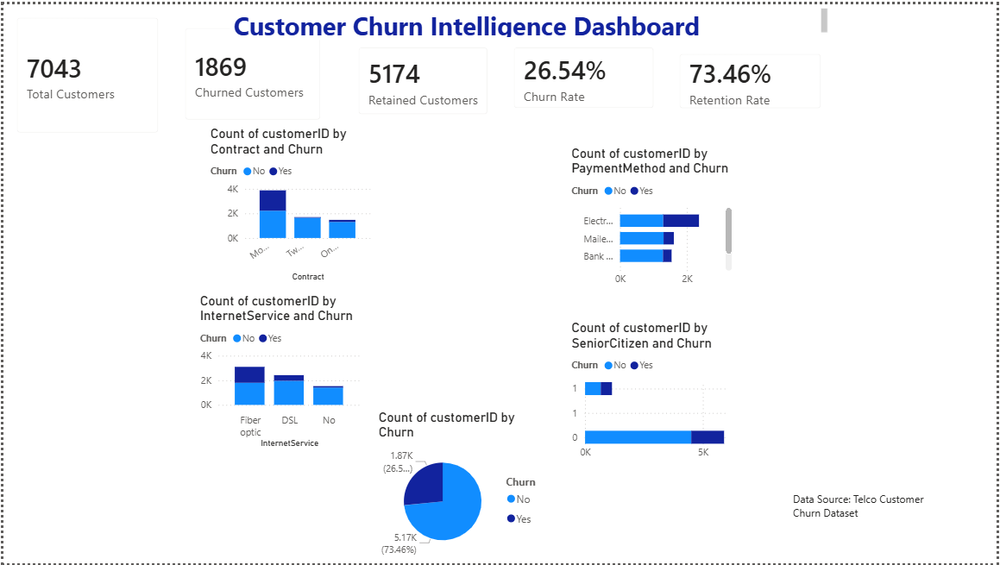

# Customer Retention Intelligence Platform

AI-powered customer churn prediction and retention analytics platform built with Python, Machine Learning, and Streamlit.

---

## Project Overview

Customer churn is one of the biggest challenges for subscription-based businesses.

This project provides:

- Customer churn prediction
- Customer segmentation
- Retention risk scoring
- Executive reporting
- Interactive business dashboard

---

## Features

### Executive Dashboard

- Total customers
- Churned customers
- Retention rate
- Business KPIs

### Customer Segmentation

Filter customers by:

- Contract type
- Internet service
- Churn status

### AI Churn Prediction

Predict customer churn risk using a trained Machine Learning model.

### Executive Reporting

Generate business reports in PDF format.

---

## Machine Learning Model

Algorithm:

- Random Forest Classifier

Performance:

- Accuracy: 78.9%
- Precision: 82%
- Recall: 91%

---

## Dashboard Screenshots

### Main Dashboard


### Customer Segmentation


### Churn Prediction


### Executive Report


---

## Technologies Used

- Python
- Pandas
- NumPy
- Scikit-Learn
- Streamlit
- Plotly
- Joblib

---

## Installation

```bash
pip install -r requirements.txt
streamlit run app.py
```

---

## Future Improvements

- XGBoost Model
- SHAP Explainability
- Real-Time API
## Power BI Dashboard

This project also includes an interactive Power BI dashboard for customer churn analysis.



Power BI file:
`Customer Churn Intelligence Dashboard.pbix`

---

## Author

Taghreed Mohammed